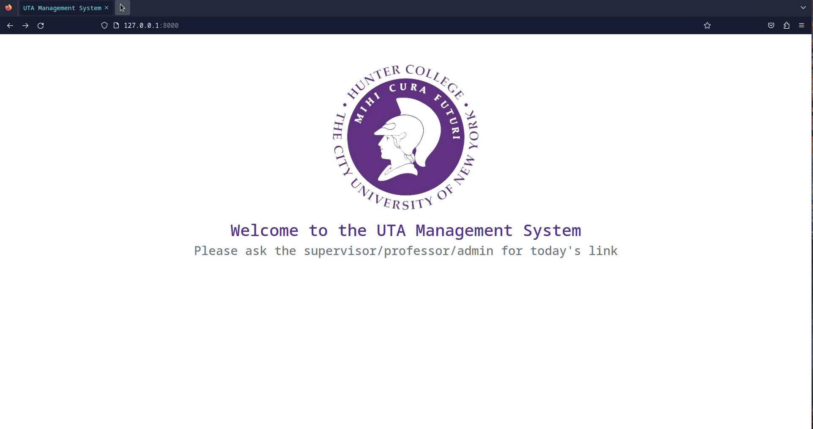
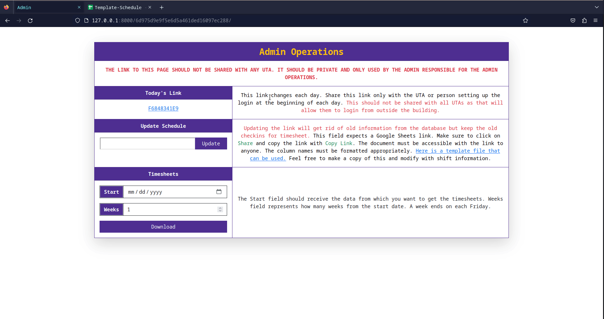
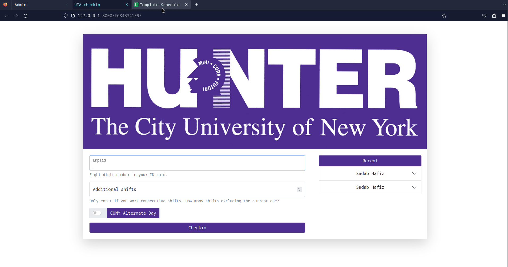
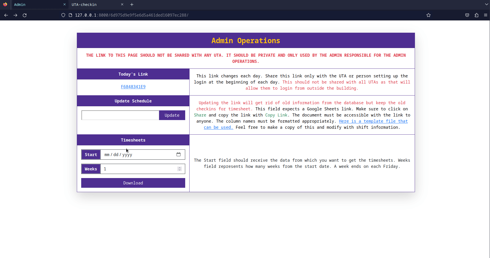
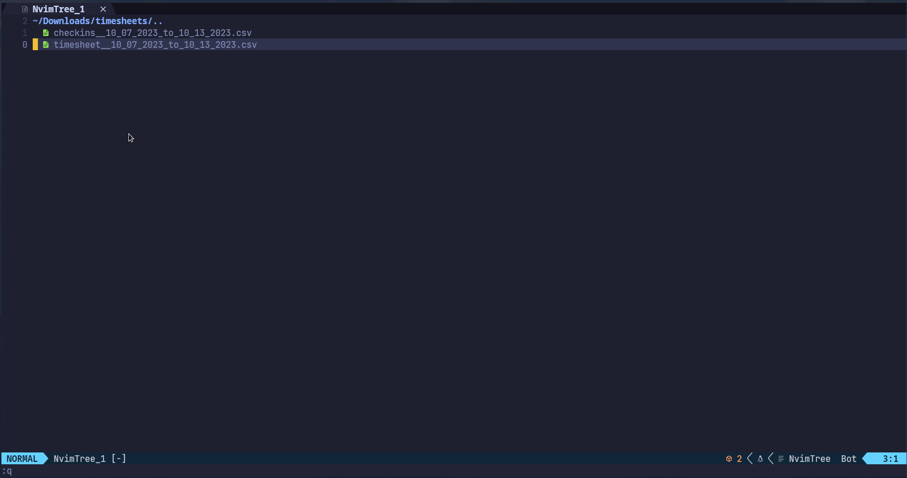

# UTA-Management-System
Filling out timesheets can be quite tedius for UTAs. It is also possible that a UTA doesn't get compensated properly because of a missing timesheet. In order to solve that problem and many more, we decided to work on an app that allows UTAs to clock in at the start of their shift and automatically track their hours.

This is an Unofficial Webapp that allows Hunter CS Department to track clock-in and clock-out for UTAs. In addition to that, admin is able to get timesheets every week with all the checkin data and hours for each UTA. Although this app is not likely to be used officially at Hunter, it was a valuable learning experience.
## Tools Used
**Backend**: django, django-REST-framework

**Frontend**: django-templates, bootstrap-css, html

## Demo

### Updating the schedule with a Google Sheets link


### The emplid should be valid and belong to a UTA on shift. 


### Additional shifts and alternate day schedule


### UTAs can cover an absent UTA


### Admins can download timesheets as CSV




## Features
- UTAs are able to check-in to their shift each day with their emplid. UTAs are not allowed to check-in if they are extremely late (1/3 of the shift).
- In addition to having access to the daily check-in link, admins are in charge of maintaining the shift schedule which should be formatted appropriately [Here is an example timesheet](https://docs.google.com/spreadsheets/d/1YZTf_KDBc0DFGWZuizB7v3jh0OH_TWyj9paQYX8ImrQ/edit?usp=sharing). 
- UTAs are able to check-in for consecutive shifts at the start of their first shift. UTAs are also able to cover absent UTAs. All this information will be available to the admins.
- Since CUNY has an alternate schedule occcassionally, UTAs are able to check-in claiming that Hunter is following the schedule of another day of the week.
- Admins are able to get timesheet for multiple weeks. Timesheet contains information about check-in and hours worked for each UTA.
- Admins are able to access the admin operations through an endpoint which should only be known by the admins. This link is not to be shared with any non-admin individuals.

## Project Setup ##
1. Set up a virtual environment for Django. Virtualenv docs: https://virtualenv.pypa.io/en/latest/installation.html
2. Clone this repository using `git clone https://github.com/Proto007/UTA-Management-System`
3. Install the libraries from requirements.txt
```
cd UTA-Management-System
pip install -r requirements.txt
```
4. Make migrations in django
```
cd uta_management_system
python manage.py makemigrations
python manage.py migrate --run-syncdb
```
5. Run server while inside uta_management_system directory: `python manage.py runserver`
## Branch naming rules ##
In order to contribute to the main branch, you must create a feature branch and pull request. Pull requests should be approved by atleast one programmer.
Branch names should be names as follows:
1. Branches should be named with initials of the person creating the branch. 
2. The initials would be followed by a '/' and name of the branch. 
3. The name of the branch should briefly describe what the branch is for.
